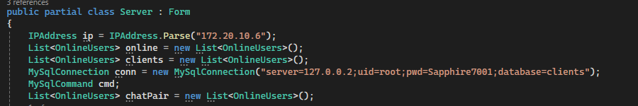
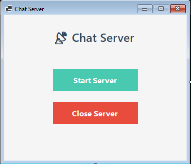
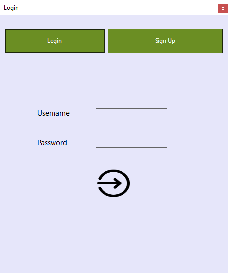
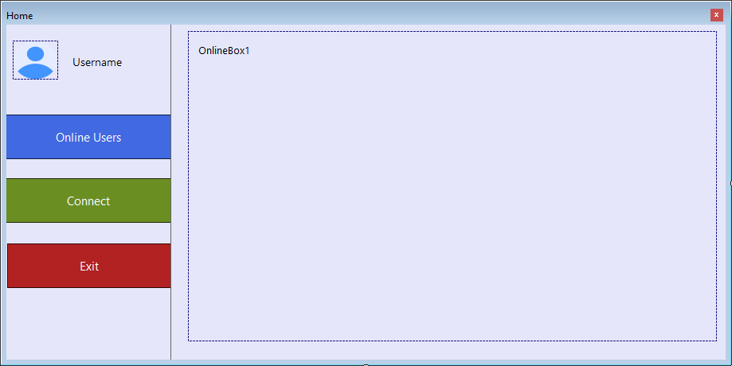

# ChatApp C#

## 👨‍💻 Author  
**Abdul Jabbar** — [LinkedIn](https://www.linkedin.com/in/abdul-jabbar-52b75631b/)

---

## 💡 Overview

**ChatApp C#** is a modern **Windows Forms-based chat application** featuring:
- ✅ TCP server-client architecture
- ✅ MySQL-backed login/signup system
- ✅ Real-time user invitation and confirmation
- ✅ Discord-inspired modern UI
- ✅ Efficient **multi-threaded server**, handling multiple client tasks concurrently

---

## 🛠️ How to Set Up

### 1. Clone and Open
- Clone the repository to your local machine
- Open the solution in **Visual Studio**

### 2. MySQL Configuration
- Run the SQL file named [`mysqlConfiguration.sql`]'mysqlConfiguration.sql' included in the project root
  - It will automatically create the required **database** and **tables**
- Ensure your MySQL server is running and accessible

### 3. IP & Database Connection Setup
- Open the main `.cs` files in both `Server` and `Client` projects
- Find and update the following parts:

```csharp
IPAddress.Parse("192.168.x.x"); // Replace with your local IP
MySqlConnection conn = new MySqlConnection("server=127.0.0.1;uid=root;pwd=yourpassword;database=clients");
```

📸 Location of these changes:


Make sure:
- The IP matches your machine's IP (check with `ipconfig`)
- The connection string has your **MySQL user**, **password**, and **host IP**

---

## ▶️ How to Run

1. **Start the Server**
   - Run the `Server` project in Visual Studio
2. **Start the Client**
   - Run the `Client` project
   - Open **two or more instances** of the Client (on same or multiple machines)
3. **Sign Up**
   - Use the Sign Up option to register accounts on each instance
4. **Online Users**
   - Click the **Online Users** button to refresh and view currently available users
5. **Send Invitation**
   - Select a user from the list and click **Connect** to send an invitation
6. **Chat**
   - Once the other user **confirms**, both users can begin chatting in real-time

✅ Tips:
- Allow both Server and Client through the **firewall**
- Ensure both apps are on the **same network**
- For remote use, configure **port forwarding** appropriately

---

## 🧠 Features

- Multi-threaded server handles:
  - Login and signup validation
  - Real-time online user tracking
  - Invitation sending and confirmation
  - Chat message relaying

- Clean, modern user interface with Discord-like theme

- Modular architecture using multiple ports:
  - Port `1`: Sign in / Sign up
  - Port `2`: Online user tracking
  - Port `3`: Availability registration
  - Port `4`: Invitation system
  - Port `5`: Chat messaging

---

## 📸 Screenshots

### 🔌 Server Interface


### 👥 Client Interface


### 🎨 UI


---

## 📂 Project Structure

```
ChatApp-CSharp/
├── Server/
│   └── Server.cs
├── Client/
│   └── Client.cs
├── images/
│   ├── IP.PNG
│   ├── server.PNG
│   ├── client.PNG
│   └── UI.PNG
├── mysqlConfiguration.sql
└── README.md
```

---

## ❓ Support

If you encounter issues or have suggestions, feel free to reach out via [LinkedIn](https://www.linkedin.com/in/abdul-jabbar-52b75631b/)
